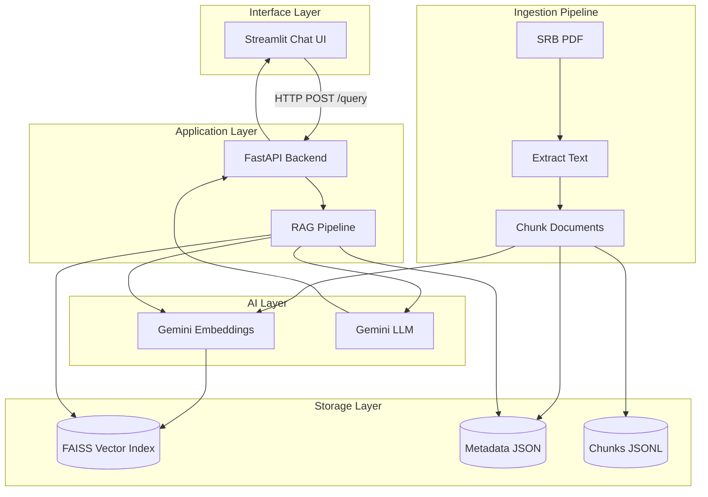

# CollegeGPT Architecture

## Overview

CollegeGPT is a Retrieval-Augmented Generation (RAG) system that allows students to ask natural language questions about the Student Resource Book (SRB) and receive answers with page citations.

## System Architecture



## Component Details

### 1. Document Ingestion Pipeline

| Script | Purpose |
|--------|---------|
| `scripts/extract_pdf.py` | Extracts text from SRB PDF page-by-page using PyMuPDF |
| `scripts/chunk_documents.py` | Splits pages into overlapping chunks (~1000 chars) |
| `scripts/build_index.py` | Generates Gemini embeddings and builds FAISS index |

### 2. RAG Pipeline (`backend/rag_pipeline.py`)

1. **Query Embedding** — Converts student question to vector via Gemini Embeddings
2. **Vector Retrieval** — Searches FAISS index for top-k similar chunks
3. **Context Assembly** — Combines retrieved chunks with page metadata
4. **Prompt Construction** — Fills retrieval prompt template with context and question
5. **LLM Generation** — Sends prompt to Gemini, receives answer
6. **Citation Extraction** — Parses [Page X] references from answer text

### 3. Backend API (`backend/app.py`)

- `POST /query` — Runs RAG pipeline, returns answer + citations
- `GET /health` — Health check

### 4. Streamlit Interface (`streamlit_app/app.py`)

- Chat-style conversation UI
- Sidebar with example questions and settings
- Expandable citation cards showing source text and page numbers
- Confidence indicator

## Data Flow

```
Student Question
    → Embed (Gemini Embeddings)
    → Search (FAISS top-k)
    → Retrieve chunk metadata
    → Assemble context
    → Generate answer (Gemini LLM)
    → Extract citations
    → Return to student
```

## Technology Stack

| Component | Technology |
|-----------|-----------|
| Backend | Python, FastAPI |
| LLM | Google Gemini 1.5 Flash |
| Embeddings | Gemini Embedding-001 |
| Vector DB | FAISS (IndexFlatL2) |
| PDF Parsing | PyMuPDF |
| Text Splitting | LangChain |
| Frontend | Streamlit |

## Future Expansion

The modular architecture supports:

- **Multi-document**: Add more PDFs to the ingestion pipeline
- **Department-specific data**: Separate FAISS indices per department
- **Website ingestion**: Add a web scraper to the ingestion pipeline
- **Authentication**: Wrap FastAPI with SSO middleware
- **Analytics**: Add query logging and a dashboard
