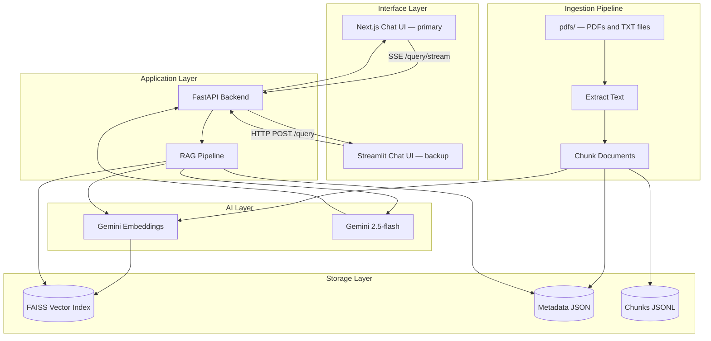

# NM-GPT Architecture

## Overview

NM-GPT is a Retrieval-Augmented Generation (RAG) system that allows students to ask natural language questions about NMIMS institutional documents and receive accurate, cited answers.

## System Architecture



## Component Details

### 1. Document Ingestion Pipeline

| Script | Purpose |
|--------|---------|
| `scripts/extract_pdf.py` | Extracts text from all PDFs and TXT files in `pdfs/`, tagging each page with its `source_doc` |
| `scripts/chunk_documents.py` | Splits pages into overlapping chunks (~1000 chars), preserving `source_doc` as the `source` field |
| `scripts/build_index.py` | Generates Gemini embeddings and builds FAISS index with resume capability |

**Current indexed documents (442 vectors):**
- Final SRB A.Y. 2025-26 — 112 pages
- Academic Calendar MPSTME 2025-26 — 1 page (text file)
- INSTRUCTIONS TO STUDENTS FOR TEE EXAM — 2 pages
- Student Code of Conduct for Examinations — 2 pages
- UFM offence penalty A.Y. 2025-26 — 3 pages
- University Examination Student Instructions — 2 pages

### 2. RAG Pipeline (`backend/rag_pipeline.py`)

1. **Query Embedding** — Converts student question to vector via Gemini Embeddings (3072-dim)
2. **Vector Retrieval** — Searches FAISS index for top-k similar chunks
3. **Context Assembly** — Combines retrieved chunks with page and source metadata
4. **Prompt Construction** — Fills retrieval prompt template with context and question
5. **LLM Generation** — Streams answer from Gemini 2.5-flash
6. **Citation Extraction** — Parses [Page X] references from answer text

### 3. Backend API (`backend/app.py`)

- `GET /health` — Health check
- `POST /query` — Synchronous RAG query, returns full answer + citations
- `POST /query/stream` — SSE streaming RAG query (primary endpoint used by Next.js frontend)

### 4. Frontends

**Primary — Next.js (`landing/`)**
- `ChatContainer.tsx` — Core logic, SSE stream reader
- `MessageBubble.tsx` — Renders user/AI messages with markdown
- `CitationBlock.tsx` — Confidence bar + expandable evidence cards
- `ChatInput.tsx` — Auto-resizing textarea, Enter to send
- `EmptyState.tsx` — Suggestion chips on first load
- `Sidebar.tsx` — Conversation history (currently hardcoded placeholder)

**Backup — Streamlit (`streamlit_app/app.py`)**
- Synchronous (no SSE streaming), uses `/query` endpoint

## Data Flow

```
Student Question
    → Embed (Gemini Embeddings, 3072-dim)
    → Search (FAISS IndexFlatL2, top-k)
    → Retrieve chunk metadata (text, source_doc, page_start, page_end)
    → Assemble context with [Page X] annotations
    → Generate answer (Gemini 2.5-flash, streamed)
    → Extract citations
    → Return to student
```

## Technology Stack

| Component | Technology |
|-----------|-----------|
| Backend | Python, FastAPI + Uvicorn |
| LLM | Google Gemini 2.5-flash |
| Embeddings | Gemini embedding-001 (3072-dim) |
| Vector DB | FAISS (IndexFlatL2) |
| PDF Parsing | PyMuPDF (fitz) |
| Text Splitting | LangChain RecursiveCharacterTextSplitter |
| Primary Frontend | Next.js 16, React 19, TypeScript, Tailwind CSS 4, Framer Motion |
| Backup Frontend | Streamlit |

## Adding New Documents

1. Place PDF (or `.txt` for scanned/image-based PDFs) in `pdfs/`
2. Run the pipeline:
   ```bash
   python scripts/extract_pdf.py
   python scripts/chunk_documents.py
   python scripts/build_index.py
   ```
3. Restart the backend — the new index is loaded automatically

## Future Expansion

The modular architecture supports:

- **More documents** — drop into `pdfs/`, re-run pipeline
- **Department-specific data** — separate FAISS indices per department, route queries by intent
- **Website ingestion** — add a web scraper to the ingestion pipeline
- **Authentication** — wrap FastAPI with SSO middleware (NextAuth.js + python-jose)
- **Analytics** — log queries to PostgreSQL, build an admin dashboard
- **Question paper lookup** — structured JSON registry with subject → Google Drive link
